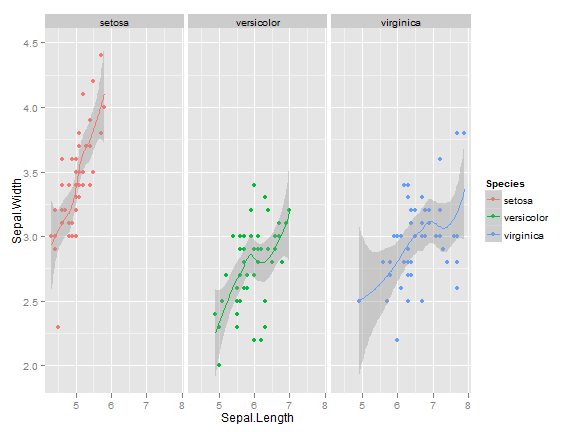

% Iris 데이터 분석 
% 전희원 
% 2012-07-05


# [Iris] 데이터 분석  

### Analysis Envirement

분석 환경의 경우 분석의 재현성을 위해 **sessionInfo()**를 활용하는것을 필수로 한다.


```r
sessionInfo()
```

```
## R version 2.15.1 (2012-06-22)
## Platform: x86_64-pc-mingw32/x64 (64-bit)
## 
## locale:
## [1] LC_COLLATE=Korean_Korea.949  LC_CTYPE=Korean_Korea.949   
## [3] LC_MONETARY=Korean_Korea.949 LC_NUMERIC=C                
## [5] LC_TIME=Korean_Korea.949    
## 
## attached base packages:
## [1] stats     graphics  grDevices utils     datasets  methods   base     
## 
## other attached packages:
## [1] knitr_0.6.3
## 
## loaded via a namespace (and not attached):
## [1] digest_0.5.2   evaluate_0.4.2 formatR_0.5    plyr_1.7.1    
## [5] stringr_0.6    tools_2.15.1  
```


만일 seed를 사용한다면 반드시 동일한 시드로 해야 재현성이 있는 분석이 가능하다. 


```r
set.seed(123)
```


## Intorduction  
개요에는 이 데이터 분석의 목적이 무엇인지 명시한다. 

* **Edgar Anderson's [Iris]** 데이터를 분석에 활용하겠고, 분석 예제를 통해서 분석 문서 템플릿을 정하는게 최종 목적이다. 
* 과정중에 질문/요청은 언제나 받는다. 


## Data explanation 

데이터 설명, 데이터 출처, 데이터 필드명 설명 

필드명        | 설명         | 비고 
------------- | -------------|-------
Sepal.Length  | 꽃받침 길이  | 비고란 
Sepal.Width   | 꽃받침 너비  | 비고란2 

데이터 위치[iris](iris.csv)는 될수 있는한 웹으로 접근 가능한 파일서버나 git에 올려두어 원격으로 패칭해서 문서생성 및 코드생성이 가능하게 한다. 


### Data Summary

데이터 요약의 경우 raw 데이터의 개략적인 모습을 보여주기 위해서 함 
개략적으로 head() 명령어나 


```r
head(iris)
```

```
##   Sepal.Length Sepal.Width Petal.Length Petal.Width Species
## 1          5.1         3.5          1.4         0.2  setosa
## 2          4.9         3.0          1.4         0.2  setosa
## 3          4.7         3.2          1.3         0.2  setosa
## 4          4.6         3.1          1.5         0.2  setosa
## 5          5.0         3.6          1.4         0.2  setosa
## 6          5.4         3.9          1.7         0.4  setosa
```

```r
summary(iris)
```

```
##   Sepal.Length   Sepal.Width    Petal.Length   Petal.Width 
##  Min.   :4.30   Min.   :2.00   Min.   :1.00   Min.   :0.1  
##  1st Qu.:5.10   1st Qu.:2.80   1st Qu.:1.60   1st Qu.:0.3  
##  Median :5.80   Median :3.00   Median :4.35   Median :1.3  
##  Mean   :5.84   Mean   :3.06   Mean   :3.76   Mean   :1.2  
##  3rd Qu.:6.40   3rd Qu.:3.30   3rd Qu.:5.10   3rd Qu.:1.8  
##  Max.   :7.90   Max.   :4.40   Max.   :6.90   Max.   :2.5  
##        Species  
##  setosa    :50  
##  versicolor:50  
##  virginica :50  
##                 
##                 
##                 
```


#### comments 
*이런식으로 각 세션당 코멘트를 넣을 수 있다.*


###  Data Preprocessing

데이터 전처리에 대한 설명 

* 되도록 전처리는 R 내에서 수행되도록 한다. 
* 예외가 있을 수 있는데, 그럴경우 스크립트 포함을 문서내 포함하거나, 따로 git 주소를 넣어주고 짧다면 코드도 넣어준다.


1. [preprocessing.py](preprocessing.py) 사용 정확한 레코드 형식으로 만들어 준다. 
2. `cut -f1-3 iris.csv` 형식으로 XX처리를 해준다. 

```python
#!/usr/bin/python

# filename : preprocessing.py

if __name__ == "__main__":
        import sys
        #start = False
        buf = []
        lcnt = 0
        for l in sys.stdin:
                lcnt = lcnt +1
                if lcnt == 1:
                        continue
                a = l.split("|")
                al = map(lambda x: x.strip(), a)
                if len(al) == 7 and lcnt != 2:
                        st = "|".join(buf[0:63])
                        stu = unicode(st, "euc-kr").encode("utf-8")
                        if len(buf) != 64:
                                sys.stderr.write(str(lcnt) + "\n")
                        else:
                                sys.stdout.write(stu + "\n")
                        #start = True
                        buf = al
                else:
                        buf = buf + al
        st = "|".join(buf[0:63])
        stu = unicode(st, "euc-kr").encode("utf-8")
        sys.stdout.write("|".join(stu) + "\n")
```
위 코드는 아래와 같은 형식으로 실행된다. 
*주의) 동작안함* 

```bash
python preprocessing.py iris.csv
```


```r
iris2 <- iris
# 정규분포를 만들기 위해 log를 취한다. 
iris2$log_sepal_length <- log(iris2$Sepal.Length)
```


### Visualization  

시각화는 대부분 [ggplot2]을 사용하길 추천한다. 그리고 되도록 코드에서 한글 사용은 피한다. 


```r
library(ggplot2)


ggplot(iris, aes(Sepal.Length, Sepal.Width)) + geom_point(aes(colour = Species))
```

 


그래프는 많으면 많을 수록 좋다. 


```r
ggplot(iris, aes(Sepal.Length, Sepal.Width, colour = Species)) + 
    geom_point() + geom_smooth() + facet_grid(. ~ Species)
```

 


#### comments 
*R코드에한글이 들어갈 경우 문제가 생길 수 있으니 되도록 한글이 들어가지 않도록 한다.*


[ggplot2]:  http://had.co.nz/ggplot2/
[Iris]: http://en.wikipedia.org/wiki/Iris_flower_data_set
[RStudio]: http://www.rstudio.org/
[R Markdown]: http://rstudio.org/docs/authoring/using_markdown


